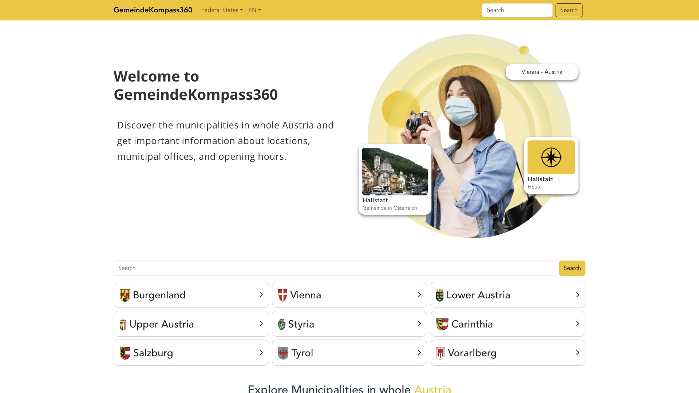
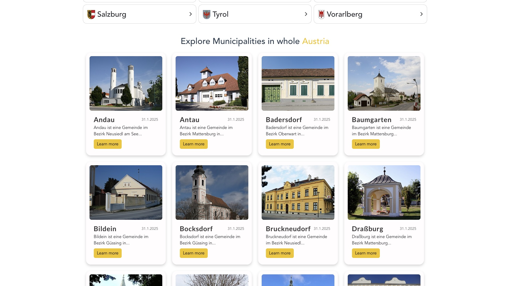
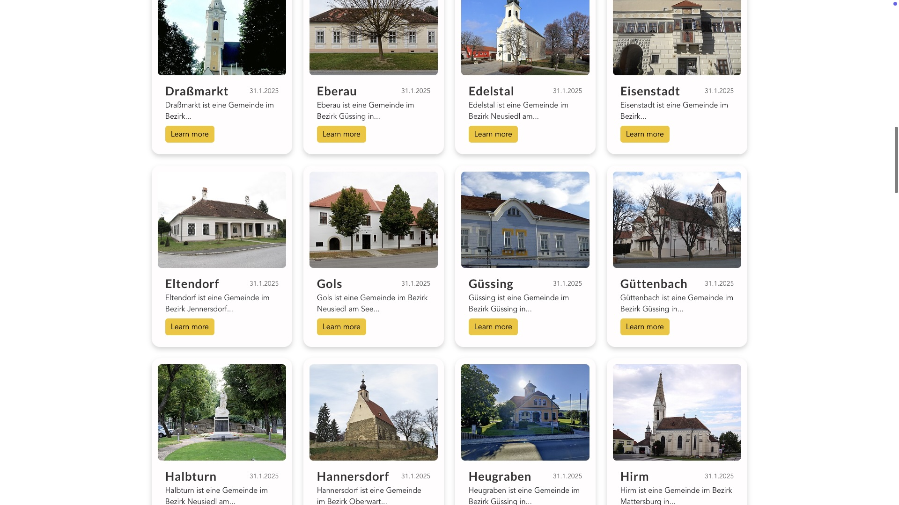
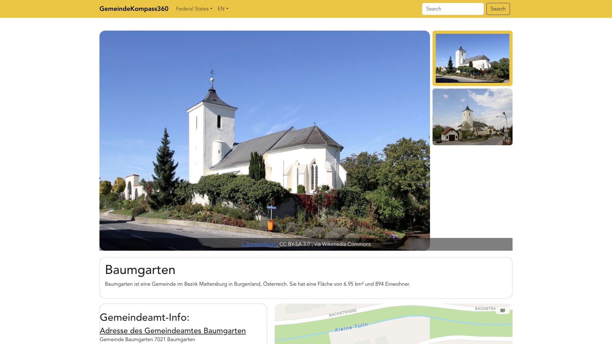
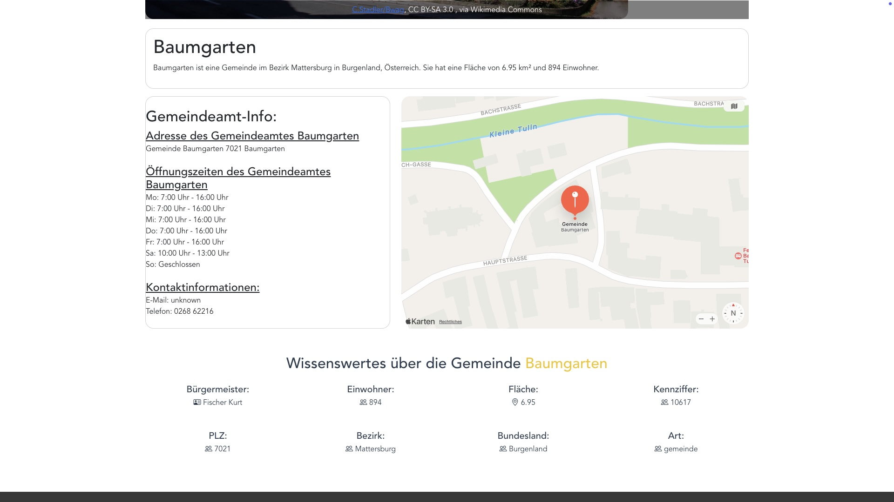

# GK360 website - gemeindekompass360

Gemeindekompass360 (translated as "Municipality Compass 360") is a website that provides detailed information about every municipality in Austria. The site includes images and facts about each municipality, such as:

- Mayor
- District
- Federal state
- Population
- Area
- Postal code

This is the final project from my GK360 project series. This is the web version.

Demo: [https://gk360.alex.polan.sk/](https://gk360.alex.polan.sk/)

My other two GK360 projects:

- API: [https://github.com/alexmen656/GK360_API](https://github.com/alexmen656/GK360_API)
- iOS app: [https://github.com/alexmen656/gemeinde-kompass-360](https://github.com/alexmen656/gemeinde-kompass-360)

## Features

- **Search**: You can search every Austrian village/town/city or county.
- **Multi-language**: German and English supported.
- **Modern & responsive design**

## How to use?

Visit the [demo site](https://gk360.alex.polan.sk/) and scroll down to see all the municipalities listed. You can also use the search field at the top of the page to find specific municipalities. The header contains navigation options to explore different regions. I think there is not much to explain in the "How to use" section as it is quite self-explanatory. Additionally, you can click on the municipality cards on the homepage to navigate to the detailed view of each municipality.

## Additional Projects
I also have an unfinished project called AirlineSimulator. The files for this project are included in this repository under the `airline-simulator` directory. Please note that this project is not yet complete.

## 📢 Disclaimer
The grammar and spelling in this README.md were improved by ChatGPT.

## Screenshots






## Project setup

```
npm install
```

### Compiles and hot-reloads for development

```
npm run serve
```

### Compiles and minifies for production

```
npm run build
```

### Lints and fixes files

```
npm run lint
```

### Customize configuration

See [Configuration Reference](https://cli.vuejs.org/config/).
